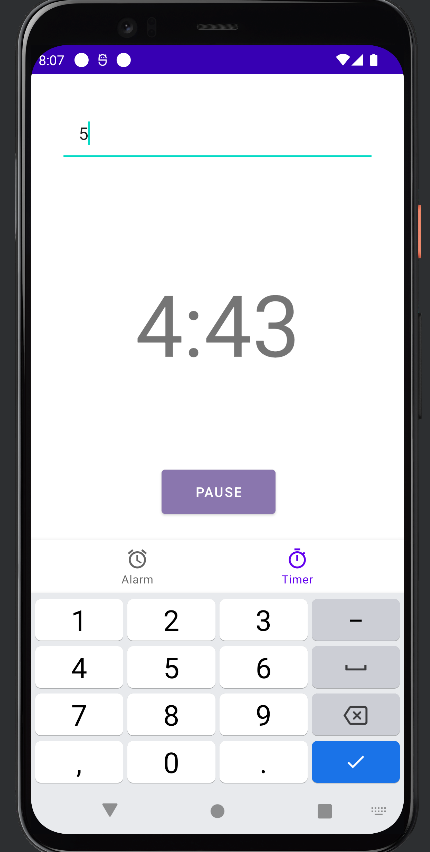
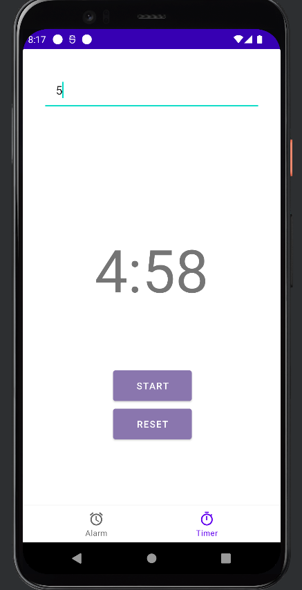
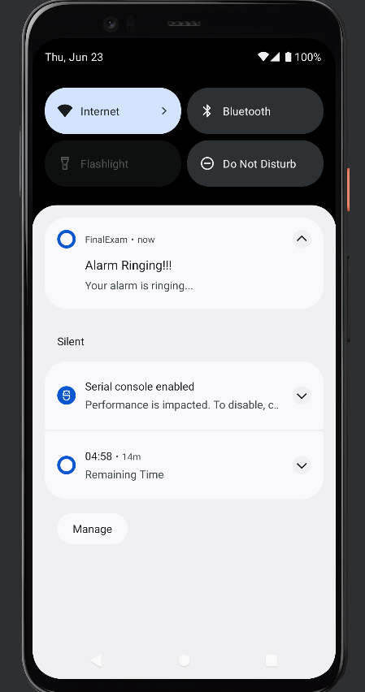

ეს არის აპლიკაცია რომელიც დაეხმარება ძილის მოყვარულ ადამიანებს არ დააგვიანონ სამსახურში და გაიღვიძონ დროულად ასევე ადამიანებს რომლებიც ძალიან დაკავებულები არიან და დაგეგმილი აქვთ რაიმე და ჭირდებათ დროის კონტროლი.
აპლიკაციის გამოყენება ხდება ძალიან მარტივად:
1) შევდვართ აპლიკაციაში.
2) ვაწვებით დამატების ღილაკს.
3) ვირჩევთ სასურველ დროს თუ რომელ საათზე გვინდა მაღვიძარამ გამოგვაფხიზლოს.
4) ვაწვებით ღილაკს " დამახსოვრება ".

5) თუ გსურთ მითითებულ დროს მაღვიძარამ აღარ დარეკოს მაშინ ვაწვებით ჩექბოქსს Notification -ის გასწვრივ, როდესაც ის განაცრისფერდება შეტყობინებებს აღარ მივიღებთ
6) ხოლო არჩეული დროის წასაშლელად დააწექით ღილაკს "Delete"

 

აპლიკაციში ასევე ხელმისაწვდომია ტაიმერი, რისი გამოყენებაც ასევე ძალიან მარტივია

1) გადავდივართ ტაიმერზე
2) ვწერთ სასურველ დროს წუთებში
3) ვაწვებით დაწყების ღილაკს "START"

4) ტაიმერის შესაჩერებლად ვაწვებით ღილაკს "PAUSE"
5) გასაგრძელებლად "START"
6) ხოლო გასანულებლად "RESET"

