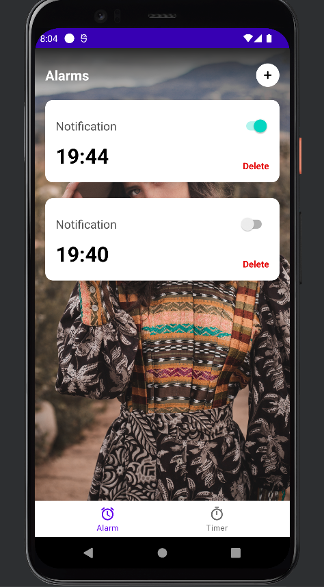
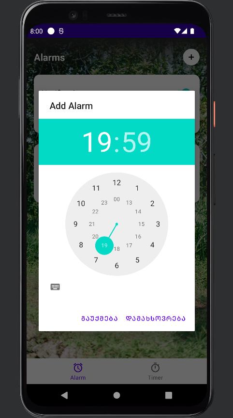

ეს არის აპლიკაცია რომელიც დაეხმარება ძილის მოყვარულ ადამიანებს არ დააგვიანონ სამსახურში და გაიღვიძონ დროულად ასევე ადამიანებს რომლებიც ძალიან დაკავებულები არიან და დაგეგმილი აქვთ რაიმე და ჭირდებათ დროის კონტროლი.
აპლიკაციის გამოყენება ხდება ძალიან მარტივად:
1) შევდვართ აპლიკაციაში.
2) ვაწვებით დამატების ღილაკს.
3) ვირჩევთ სასურველ დროს თუ რომელ საათზე გვინდა მაღვიძარამ გამოგვაფხიზლოს.
4) ვაწვებით ღილაკს " დამახსოვრება ".

    თუ გსურთ მითითებულ დროს მაღვიძარამ აღარ დარეკოს მაშინ ვაწვებით ღილაკს Notification -ის გასწვრივ, როდესაც ის განაცრისფერდება შეტყობინებებს აღარ მივიღებთ
    ხოლო არჩეული დროის წასაშლელად დააწექით ღილაკს "Delete"

 
